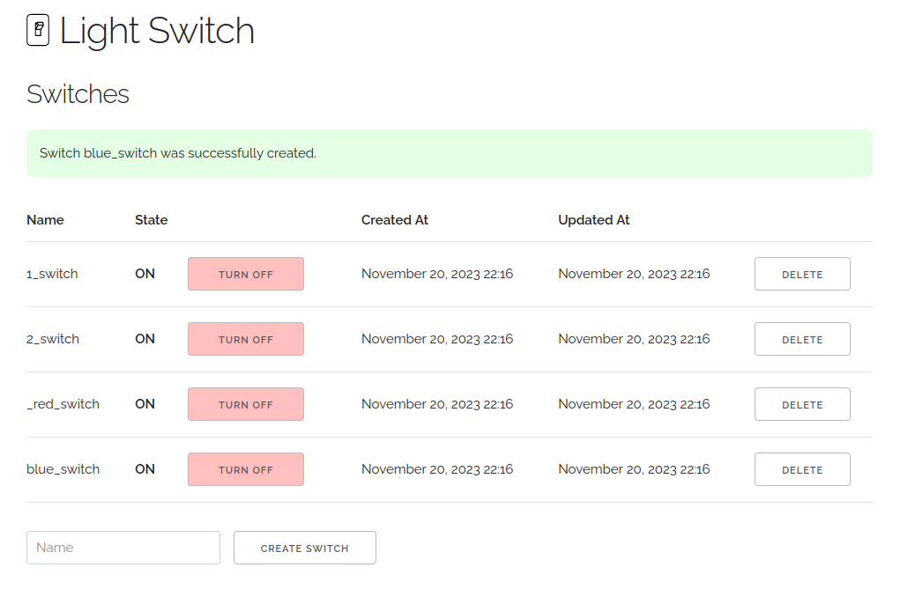

# LightSwitch

Simple circuit breakers on Rails

## Use Cases

`LightSwitch` aims to be a very simple circuit breaker implementation. You can
use a `LightSwitch` to turn things on and to turn things off. That's pretty much
it.

[Stoplight](https://github.com/bolshakov/stoplight) and
[Circuitbox](https://github.com/yammer/circuitbox) are excellent, full-featured
[circuit breaker](https://martinfowler.com/bliki/CircuitBreaker.html) libraries.
`LightSwitch` is much more basic. In particular, `LightSwitch` does not
dynamically respond and adjust to errors. As the operator of your application,
you are expected to manually turn switches off and on when you need to.

You may ask, "If I have turned off a particular piece of code, how do I know
when it's okay to turn it back on?"  That's a great question but it's not one
that `LightSwitch` tries to answer for you. `Stoplight` and `Circuitbox` are
great at that sort of circuit breaking.  Maybe you are monitoring a third-party's
status page. Maybe another team is fixing their service and will let you know
when the service is back up. Maybe you just turn your piece of code back on and
monitor things closely.

Some apps may not need the sophisticated, powerful behavior of `Stoplight` or
`Circuitbox`; some apps may not run their recommended infrastructure (e.g. Redis).
For simple cases where you are already running Rails, you may prefer the
simplicity of `LightSwitch`.

### LightSwitch vs. Flipper

`LightSwitch` imitates [Flipper](https://github.com/flippercloud/flipper) when
it comes to its API.  If you want to use `Flipper` for your circuit breaking
needs, go for it.  Some teams prefer to reserve `Flipper` strictly for feature
flags.  Some organizations expose the Flipper UI to a wide range of internal
users especially if Product Managers enable and disable features on behalf of
customers.  You probably want to limit the exposure of your `LightSwitches`.  You
would not want someone to turn off a piece of code unless they really knew what
they were doing.  `Lightswitch` can give you a little separation between feature
flags and circuit breakers.  `Flipper` is well-suited to do the job if you want
to use it, though.

## Usage

A `LightSwitch::Switch` has two states, `on` and `off`. This gem's convention
is that an `off` switch will short circuit a given piece of code.  Therefore
the recommended usage of `LightSwitch` is something like this:
```ruby
def my_method
  return if LightSwitch.off?(:my_switch)

  do_stuff
end
```

Or

```ruby
def my_method
  do_stuff if LightSwitch.on?(:my_switch)
end
```

You can interpret `off` and `on` however you want; it's up to you.
What few defaults `LightSwitch` implements assume the convention above, though.

### Operating Switches

If you have Rails console access, you can turn switches on and off:

```ruby
LightSwitch[:my_switch].on!  # turns the switch on
LightSwitch[:my_switch].off! # turns the switch off
```

### LightSwitch UI

LightSwitch comes with a web UI that can be mounted in your rails application.



Just add the following to `config/routes.rb`:

```ruby
Rails.application.routes.draw do
  mount LightSwitch::Engine => "/light_switch"
end
```

You can limit access to the UI by using
[Rails routing constraints](https://guides.rubyonrails.org/routing.html#advanced-constraints).

### Configuration

You most likely want to initialize all of your switches when your app boots up.
This ensures that the switches are present in the LightSwitch UI so that you
can easily manage them. If you forget to initialize a switch, `LightSwitch` will
assume that the switch is `on` so that your code guarded by a switch will run
(assuming you follow the conventions demonstrated above). You can initialize
your switches in a Rails initializer.

```ruby
# config/initializers/light_switch.rb

LightSwitch.configure do |config|
  config.switches = %i[
    one_switch
    two_switch
    red_switch
    blue_switch
  ]
end
```

### Caching

By default, `LightSwitch` does not leverage caching, but you can configure
`LightSwitch` to use a cache if you have performance concerns. For example,
`Rails.cache` may be configured by setting `LightSwitch.config.cache` in a
Rails initializer:

```ruby
# config/initializers/light_switch.rb

LightSwitch.configure do |config|
  config.cache = Rails.cache
end
```

You should **not** use an in-memory cache for `LightSwitch`.  `LightSwitch`
caches values indefinitely and will reset cached values whenever an
underlying `LightSwitch::Switch` model is changed.  If you are using an
in-memory cache, `LightSwitch` has no way to clear the caches used by all of
the various processes running your application (web workers, Sidekiq workers, etc.).
If you are using a centralized cache, like Redis or MemCached, feel free to use
it with `LightSwitch`.  The queries to read a switch from the database are
indexed and will return very quickly, so most `LightSwitch` users will not
need caching.

You can also implement your own cache as long as it implements the interface
of [`LightSwitch::NullCache`](lib/light_switch/null_cache.rb).

### ActiveSupport::Notifications

If you wish to be notified of changes made to any switches, you can subscribe
to [`ActiveSupport::Notifications`](https://api.rubyonrails.org/classes/ActiveSupport/Notifications.html)
published by LightSwitch.  There are three events available:

* `create_committed.switch.light_switch`
* `destroy_committed.switch.light_switch`
* `update_committed.switch.light_switch`

An example use case could be logging changes for visibility:

```ruby
# config/initializers/light_switch.rb

ActiveSupport::Notifications.subscribe("update_committed.switch.light_switch") do |*args|
  event = ActiveSupport::Notifications::Event.new(*args)
  switch = event.payload[:switch]

  Rails.logger.info("#{switch.name} is now #{switch.state}")
end
```

The events captured do not capture any meaningful latency metrics. They are just
published events once changes to a `LightSwitch::Switch` are committed.

## Installation
Add this line to your application's Gemfile:

```ruby
gem "light_switch"
```

And then execute:
```bash
$ bundle
```

Or install it yourself as:
```bash
$ gem install light_switch
```

## Contributing
Fork this repo and submit a pull request.

If you find a bug or have a feature request, please open a GitHub issue.

## License
The gem is available as open source under the terms of the [MIT License](https://opensource.org/licenses/MIT).
